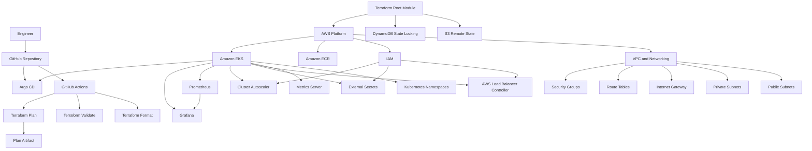
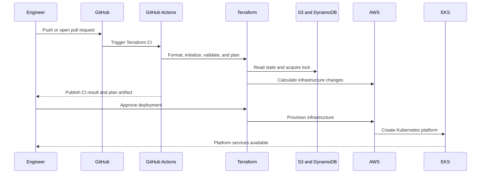
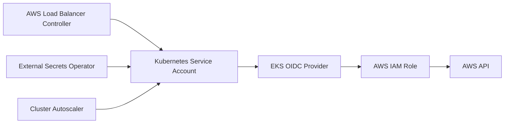
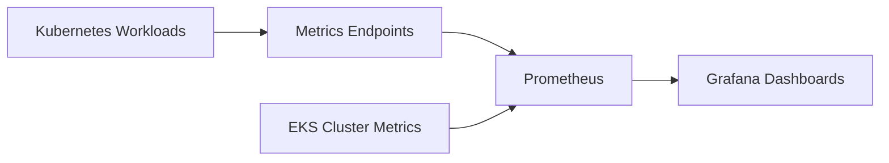
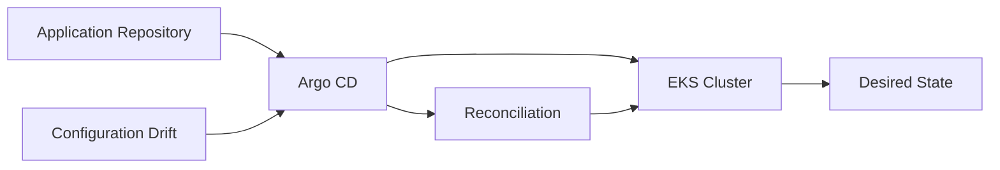

# Platform Architecture

## High-Level Architecture



## Provisioning Flow



## Dependency Layers

```text
Layer 1: Remote State
  S3 bucket
  DynamoDB lock table

Layer 2: AWS Foundation
  VPC
  Subnets
  Internet gateway
  Route tables
  Security groups
  IAM
  ECR

Layer 3: Kubernetes Compute
  EKS control plane
  EKS worker nodes
  OIDC provider

Layer 4: Platform Services
  Namespaces
  Metrics Server
  AWS Load Balancer Controller
  External Secrets
  Cluster Autoscaler

Layer 5: Observability and Delivery
  Prometheus
  Grafana
  Argo CD

Layer 6: Automation
  GitHub Actions
  Terraform validation
  Terraform plan artifacts
```

## Trust and Identity Flow



IRSA reduces the need for long-lived AWS credentials inside Kubernetes workloads.

## Observability Flow



## GitOps Flow



## Design Principles

- Reusable Terraform modules
- Clear separation between bootstrap and environment stacks
- Private EKS workload placement
- IAM Roles for Service Accounts
- Encrypted and versioned Terraform state
- Declarative Kubernetes platform services
- Internal service exposure by default
- Automated validation before deployment
- GitOps-ready application delivery
